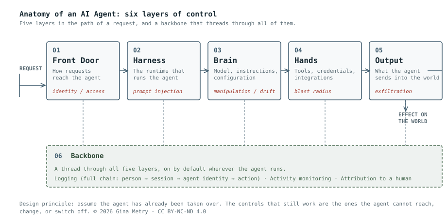

# AI Agent Security Controls

**A layered framework for securing AI agents, built by taking the agent apart.**

> Don't design your security around the agent behaving correctly. Design it around the agent being fully compromised.

Most security frameworks treat an AI agent as a black box: a thing that receives a prompt and does work. That framing hides the attack surface. This framework dissects the agent into six parts and lays controls at each one, so that every place an attacker can enter, manipulate, or exfiltrate has a named owner and a named defence.

It was written from practice, not theory: the controls below were developed while securing real, autonomous, chat based agents that read untrusted input continuously, the riskiest end of the agent spectrum. The controls are written to be agnostic: they apply to any agent, scoped to each agent's own risk profile and use case.

## The anatomy

An agent has five parts in the flow of a request, and one that runs through all of them:

| Part | What it is |
|---|---|
| **1. Front Door** | How requests reach the agent, the interface where instructions arrive and identity is (or isn't) checked. |
| **2. Harness** | The software that runs the agent, the orchestration loop that receives requests, calls the model, runs tools, and returns results. Also called the orchestrator. It is the agent's runtime environment and the container around everything it does. |
| **3. Brain** | The model plus the instructions, skills, and configuration that shape its judgement. It is what the agent *is*. Change the brain and you change the agent. |
| **4. Hands** | The tools, credentials, and integrations the agent can use to act on the world, everything it can reach and do beyond talking. |
| **5. Output** | Everything the agent produces and sends back into the world: answers, reports, created tickets, merged changes, deleted records. The point where the agent's reasoning becomes a real world effect. |
| **6. Backbone** | Not a sixth position in the flow but a thread that runs through all five parts: logging, monitoring, and attribution, on by default wherever the agent runs. |

## Why the layers matter

Each layer has its own dominant threat, and controls placed at the wrong layer fail quietly:

- The **front door** is where identity is won or lost. An agent is a powerful set of hands, and an open front door means those hands are available to anyone who finds the endpoint.
- The **harness** is where prompt injection, direct and indirect, must be contained. Injection is the number one risk to mitigate at this layer.
- The **brain** is the layer you don't fully control, so you constrain around it: label what goes in, detect manipulation, protect the instructions that define it.
- The **hands** are where blast radius is set. Least privilege and need to know here decide what a compromised agent can actually touch.
- The **output** is the last gate before the agent's reasoning becomes someone else's problem. A successful injection doesn't need the agent to *do* anything. It can leak data simply by including it in what the agent says.
- The **backbone** is what makes the other five auditable. If the agent can edit its own logs, none of the above can be trusted after an incident.

## The controls

The full catalogue, 25 controls grouped by layer, each with what it does, why it exists, and where it must be enforced, is in **[CONTROLS.md](CONTROLS.md)**.

## How to use this framework

Take any agent (yours, a vendor's, or one you are reviewing) and walk it through the six parts:

1. What enters at the front door, and who is allowed to send it?
2. What does the harness permit the agent to attempt?
3. What shapes the brain, and who can change it?
4. What can the hands reach, and with whose credentials?
5. What leaves through the output, and what checks it first?
6. If this agent were fully compromised right now, what would the backbone show you?

If any question has no answer, that layer has no owner, and that is where the incident will start.

## A note on frontier vs. open weight models

With a frontier model behind the brain, safety is a shared responsibility with a floor set by the provider: refusals, abuse monitoring, rate limiting, a kill switch, their red team. With a local or open weight model, that floor is zero and you own the entire stack. Every control in this framework still applies, but the ones you might have been silently borrowing from a provider (refusal behaviour, API side logging) must now be built and enforced by you, ideally at a gateway outside the model's reach.

**The same property that makes open weight models risky makes them useful to defenders.** Owning the whole stack is a real burden when you are deploying an agent, and increasingly a reason defenders reach for these models anyway. Analysing live attack material, reproducing an adversarial technique, or building tooling to defend against agentic attacks often means working with content a safety tuned model will refuse. Defenders are turning to open weight models precisely because they are unrestricted. The control implication is unchanged: the guardrails you did not inherit have to be built and enforced by you, at a gateway outside the model's reach. The same conclusion, arrived at from the opposite direction.

## References

The thinking behind this framework was shaped by practitioner research presented at the **[Real World AI Security Conference, Stanford University, June 2026](https://www.youtube.com/@RealWorldAISecConf)**, and by the public disclosures of real AI security incidents.

## Author

**Gina Metry**: Security Controls Principal; CISSP, PCI ISA. I secure and operate AI agents in live environments and define the controls that let them be trusted.

Framework, threat model, and controls by Gina Metry, developed with the assistance of Anthropic's Claude models (Fable 5 and Opus 5) and refined through practice with an AI engineering team.

---

© 2026 Gina Metry. All rights reserved.

This work is licensed under [CC BY-NC-ND 4.0](https://creativecommons.org/licenses/by-nc-nd/4.0/): you may share it with attribution, but may not use it commercially or distribute modified versions. See [LICENSE](LICENSE).
